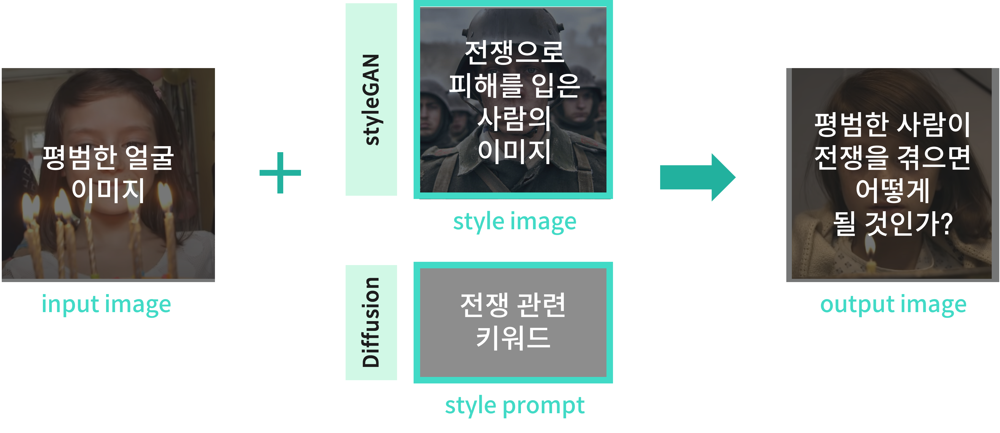
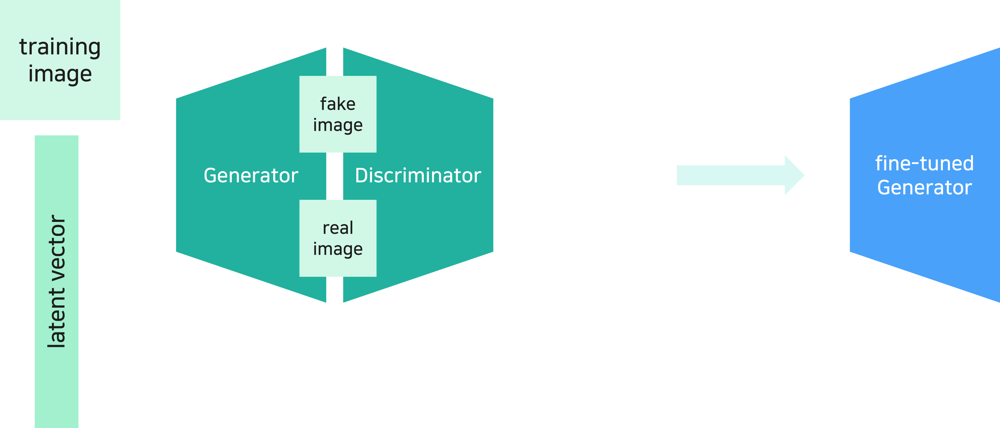
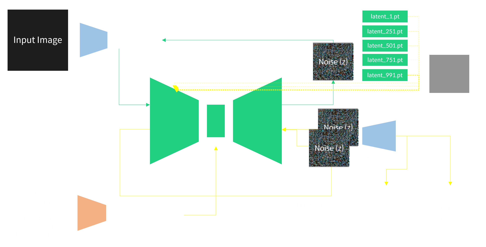

# 🌟AI for No War
📢 **2023년 겨울학기 [AIKU](https://github.com/AIKU-Official) 활동으로 진행한 프로젝트입니다**

## 소개

대부분의 사람들이 전쟁을 자신과 동떨어진 사건으로 바라보고, 심각성을 깨닫지 못하고 있습니다. 


유니세프에서 진행했던 Deep Empathy project는 이 문제를 해결하기 위해 AI 기술을 사용하였습니다. 평범한 대도시 이미지에 전쟁 중인 도시의 이미지를 합성하여 전쟁의 파괴성을 느끼도록 한것입니다. 

이에 착안을 얻어, style transfer 기능을 가진 모델을 통해 평범한 사람들이 전쟁으로 인해 변화된 모습을 생성하는 프로젝트를 기획하였습니다. 이를 통해 전쟁으로 인해 사람이 어떻게 변화하는지 보여주어 전쟁의 심각성을 고발하고, 전쟁 문제를 상기시키고자 합니다.


## 방법론

- 평범한 얼굴에 '전쟁'이라는 style을 입히는 모델을 만들고자 하였습니다.
  <p align="center"></p>
- 위 이미지에 표현되어 있듯이, 2가지 파이프라인으로 진행하였습니다.
  1) style feature를 이미지에서 추출
  2) style feature를 텍스트에서 추출 
- 구글링을 통해 전쟁을 겪은 사람들의 이미지를 수집하여 데이터셋을 구성하였습니다. dlib 라이브러리를 사용하여 얼굴 위주로만 크롭한 후 사용하였습니다.


- **Model 1. StyleGAN2-based** StyleGAN2는 Styel transfer의 대표적인 모델인 StyleGAN에서 일부 문제를 개선한 모델입니다. input image(평범한 얼굴)과 style image(전쟁 이미지)를 입력하면 style image에서 style을 추출하여 원하는 style을 가진 이미지를 생성합니다. discriminator의 판별 성능과 함께 generator가 전쟁 style에 가까운 얼굴 이미지를 생성할 수 있도록 학습합니다.
<p align="center"></p>

- **Model 2. Diffusion-based** Plug and Play Diffusion은 input image(평범한 얼굴)과 style text(전쟁 관련 키워드)를 입력하면 text에서 style을 추출하여 원하는 style을 가진 이미지를 생성합니다. Stable-Diffusion 기반의 모델이며, 학습이 필요하지 않습니다.
<p align="center"></p>

## 환경 설정

### Requirements

- Python >= 3.8.5
- PyTorch


## 사용 방법

- Model 1. StyleGAN2-based

  ```bash
  cd stylegan2-based
  python 
  ```

- Model 2. Diffusion-based

  ```bash
  cd pnp-diffusion
  python 
  ```

## 예시 결과
